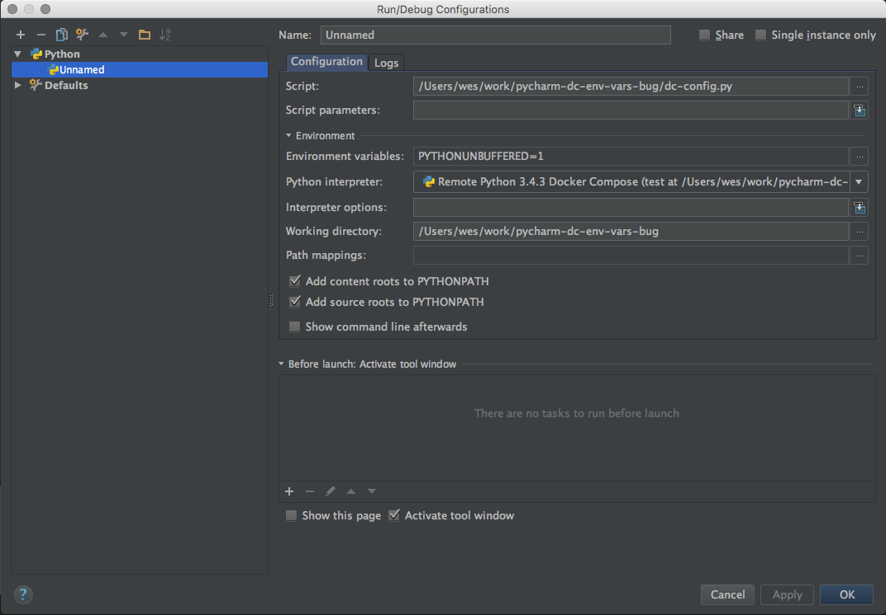

#Setup

1. Setup env var: `echo 'export MY_TEST_VAR="yay"' >> ~/.bashrc && source ~/.bashrc`

2. Run docker-compose and see that it picks up local env's vars and stuffs them into the container:
`
$ docker-compose run --rm test bash -c "env | grep MY_TEST_VAR"
MY_TEST_VAR=yay
`
3. Setup Pycharm remote debugging project interpreter using docker-compose option, pointed to yml file in this project. 

4. Setup new run configuration option pointed to dc-config.py using configured interpreter. 

5. Run the above configuration and see that PyCharm does not pick up local env's vars:

```
pycharmdcenv:python3 -u /opt/project/dc-config.py
PATH=/usr/local/sbin:/usr/local/bin:/usr/sbin:/usr/bin:/sbin:/bin
HOSTNAME=e0698a022ce4
PYTHONPATH=/opt/project
PYTHONUNBUFFERED=1
PYCHARM_HOSTED=1
PYTHONIOENCODING=UTF-8
HOME=/root
```


#Questions:

1. Why not?

2. How can we accomplish the same inheriting of env vars?